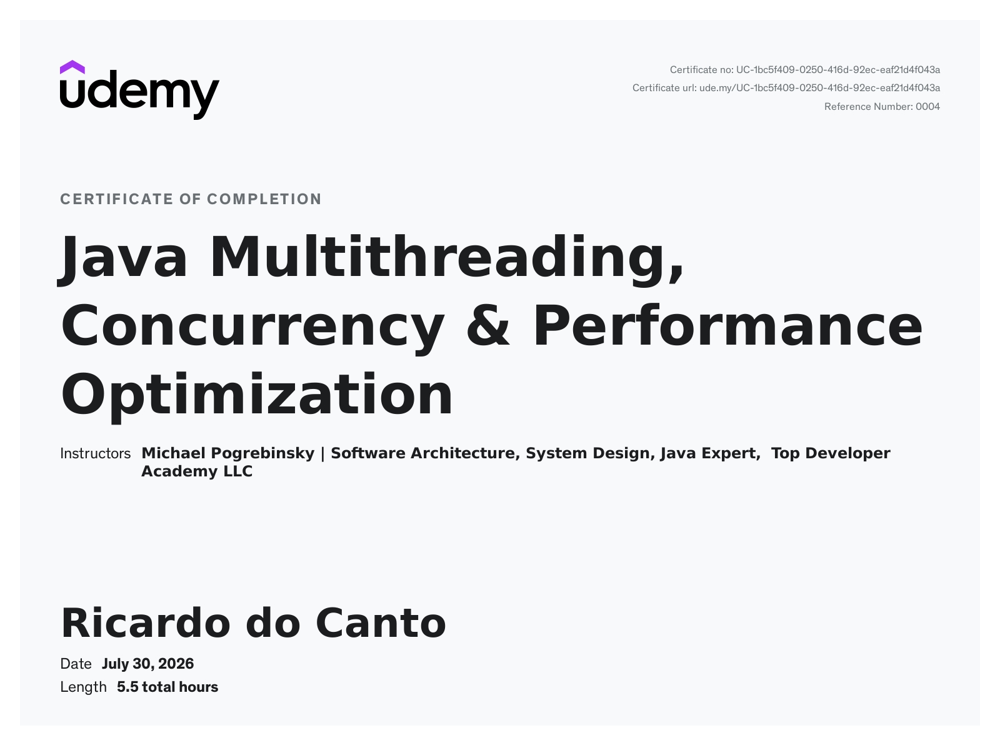

# Java Multithreading, Concurrency & Performance Optimization

The examples and code for the
[Java Multithreading, Concurrency & Performance Optimization](https://www.udemy.com/course/java-multithreading-concurrency-performance-optimization/)
course, created by [Michael Pogrebinsky](https://www.linkedin.com/in/michaelpog), is stored in [this](.) folder.

## Course Certificate

## Course Content

### Section 1: Introduction

+ [x] Motivation & Operating Systems fundamentals - Part 1
+ [x] Operating Systems Fundamentals - Part 2
+ [x] Quiz 1: Threading and Operating Systems Fundamentals Quiz

### Section 2: Threading fundamentals - Thread Creation

+ [x] Tips about Coding Lectures and Debugging Instructions
+ [x] Threads Creation - Part 1, Thread Capabilities & Debugging
+ [x] Threads Creation - Part 2. Thread Inheritance
+ [x] Quiz 2: Thread Creation
+ [x] Coding Exercise 1: Thread Creation - MultiExecutor
+ [x] Thread Creation - MultiExecutor Solution

### Section 3: Threading fundamentals - Thread Coordination

+ [x] Thread Termination & Daemon Threads
+ [x] Quiz 3: Thread Termination & Daemon Threads
+ [x] Joining Threads
+ [x] Coding Exercise 2: Multithreaded Calculation
+ [x] Multithreaded Calculation - Solution

### Section 4: Performance Optimization

+ [x] Introduction to Performance & Optimizing for Latency - Part 1
+ [x] Optimizing for Latency Part 2 - Image Processing
+ [x] Additional Resource - Image Processing, Color Spaces, Extraction & Manipulation
+ [x] Optimizing for Throughput Part 1
+ [x] Optimizing for Throughput Part 2 - HTTP server + Jmeter
+ [x] Quiz 4: Performance Optimization

### Section 5: Data Sharing between Threads

+ [x] Stack & Heap Memory Regions
+ [x] Quiz 5: Stack & Heap Memory Regions
+ [x] Resource Sharing & Introduction to Critical Sections

### Section 6: The Concurrency Challenges & Solutions

+ [x] Critical Section & Synchronization
+ [x] Quiz 6: Critical Section & Synchronization
+ [x] Atomic Operations, Volatile & Metrics practical example
+ [x] Quiz 7: Atomic Operations, Volatile & Metrics practical example
+ [x] Coding Exercise 3: Min - Max Metrics
+ [x] Min - Max Metrics - Solution
+ [x] Race Conditions & Data Races
+ [x] Quiz 8: Data Races
+ [x] Locking Strategies & Deadlocks
+ [x] Quiz 9: Locking Strategies & Deadlocks

### Section 7: Advanced Locking

+ [x] ReentrantLock Part 1 - tryLock and interruptible Lock
+ [x] ReentrantLock Part 2 - User Interface Application example
+ [x] Quiz 10: ReentrantLock
+ [x] Reentrant Read Write Lock & Database Implementation
+ [x] Quiz 11: Read-Write Locks
+ [x] Coding Exercise 4: Product Reviews Service
+ [x] Product Reviews Service - Solution

### Section 8: Inter-Thread Communication

+ [x] Semaphore - Scalable Producer Consumer implementation
+ [x] Quiz 12: Semaphores - Barrier
+ [x] Condition Variables - All purpose, Inter-Thread Communication
+ [x] Objects as Condition Variables - wait(), notify() and notifyAll()
+ [x] Quiz 13: Condition Variables
+ [x] Coding Exercise 5: Simple CountDownLatch
+ [x] Simple CountDownLatch - Solution

### Section 9: Lock-Free Algorithms, Data-Structures & Techniques

+ [x] Introduction to Non-blocking, Lock Free operations
+ [x] Atomic Integers & Lock Free E-Commerce
+ [x] Atomic References, Compare And Set, Lock-Free High Performance Data Structure
+ [x] Quiz 14: Lock-Free Algorithms, Data-structures & Techniques

### Section 10: Threading Models for High Performance IO

+ [x] Introduction to Blocking IO
+ [x] Thread Per Task / Thread Per Request Model
+ [x] Asynchronous, Non Blocking IO with Thread Per Core Model
+ [x] Quiz 15: Threading Models for High Performance IO - Quiz

### Section 11: Virtual Threads and High-Performance IO

+ [x] Introduction to Virtual Threads
+ [x] High Performance IO with Virtual Threads
+ [x] Virtual Threads Best Practices
+ [x] Quiz 16: Virtual Threads and High-Performance IO

### Section 12: Beyond Multithreading - Final Lecture

+ [x] Distributed Systems, Big Data & Performance
+ [x] Bonus Lecture - Keep Learning
